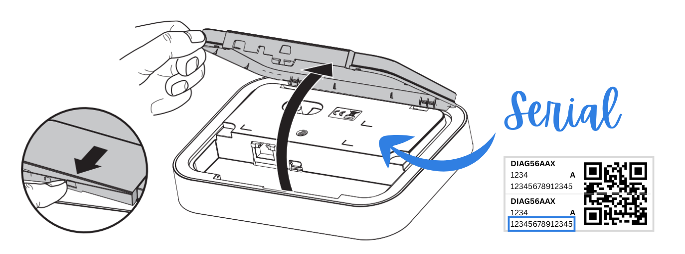

<p align="center">
  
</p>
<p align="center">
    <h1 align="center">PyDiagral</h1>
</p>
<p align="center">
    A powerful and easy-to-use Python library for seamless integration with the Diagral alarm system.
</p>
<p align="center">
	
	
	
	
<p>
<p align="center">
    
    
    <a href="https://github.com/mguyard/pydiagral/actions/workflows/lint.yaml" target="_blank">
        
    </a>
    <a href="https://github.com/mguyard/pydiagral/actions/workflows/release_and_doc.yaml" target="_blank">
        
    </a>
<p>
<p align="center">
	<!-- default option, no dependency badges. -->
</p>
<br /><br />

# Documentation pydiagral

Welcome to the documentation for pydiagral, a Python library for interacting with the Diagral API.

## About pydiagral

pydiagral is an asynchronous Python interface for the Diagral alarm system. This library allows users to control and monitor their Diagral alarm system through the official API.

## Requirement

To use this library, which leverages the Diagral APIs, you must have a Diagral box (DIAG56AAX). This box connects your Diagral alarm system to the internet, enabling interaction with the alarm system via the API. You can find more information about the Diagral box [here](https://www.diagral.fr/commande/box-alerte-et-pilotage).

## Key Features

The `DiagralAPI` class offers the following functionalities:

- **Authentication**:

  - Connect to the Diagral API with username and password
  - Manage access tokens and their expiration
  - Create, validate, and delete API keys

- **System Configuration**:

  - Retrieve alarm configuration

- **System Information**:

  - Obtain system details
  - Retrieve the current system status
  - Manage webhooks
  - Manage anomalies

- **System Interraction**:
  - Activate or Desactivate system (partially or globally)
  - Automatism actions

## Quick Start

To get started with pydiagral, follow these steps:

1. Installation:

   ```bash
   pip install pydiagral
   ```

2. Example

A modular and easy-to-use test script is available [example_code.py](https://github.com/mguyard/pydiagral/blob/main/example_code.py) to help you get started with the library.

Simply create a `.env` file with the following content:

```properties
USERNAME=your_email@example.com
PASSWORD=your_password
SERIAL_ID=your_serial_id
PIN_CODE=your_pin_code
LOG_LEVEL=DEBUG
```

And run the [example_code.py](https://github.com/mguyard/pydiagral/blob/main/example_code.py).

> [!TIP]
>
> You can customize the actions performed by [example_code.py](https://github.com/mguyard/pydiagral/blob/main/example_code.py) by modifying the parameters in the code, as indicated by the `CUSTOMIZE THE TESTS` section title.

## Diagral API Official documentation

Official Diagral API is available [here](https://appv3.tt-monitor.com/emerald/redoc).

## Development Documentation

Library documentation is available [here](https://mguyard.github.io/pydiagral/).

## How to find Serial on DIAG56AAX

The serial number can only be found with physical access to the box. You need to open it, and you will find a label with a QR Code.
On this label, there is a 15-character code that represents the serial number of the box.



> [!IMPORTANT]
>
> This code is necessary to use this library and Diagral API.

## Library Structure

For detailed library documentation, please refer to the following sections:

- [API Reference](https://mguyard.github.io/pydiagral/api/): Comprehensive documentation of the DiagralAPI class and its methods
- [Data Models](https://mguyard.github.io/pydiagral/models/): Description of the data structures used
- [Exceptions](https://mguyard.github.io/pydiagral/exceptions/): List of package exceptions

## Contribution

Contributions to pydiagral are welcome! Please check our contribution guidelines for more information on how to participate in the development of this library.

## License

pydiagral is distributed under the GPL-v3 License. See the [LICENSE](https://github.com/mguyard/pydiagral/blob/main/LICENSE) file for more details.
